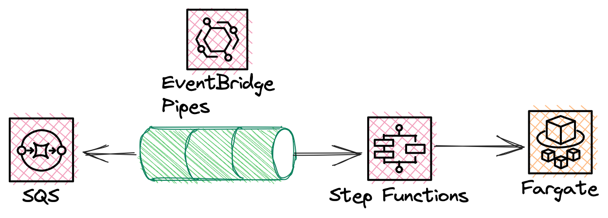
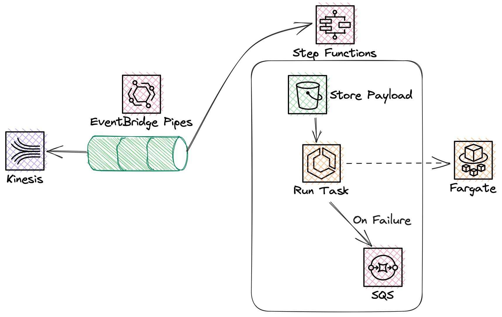
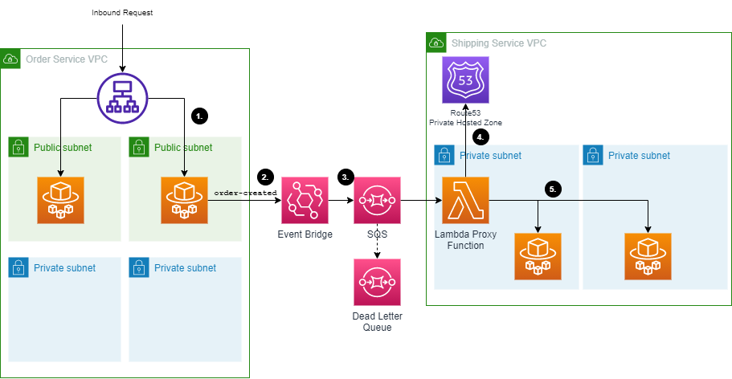

# Event Driven Patterns with Serverless Containers

This repository demonstrates patterns of event driven architecture using container based applications built on top of AWS serverless compute.

## Serverless Queue Processors



This pattern demonstrates how you can run a container based applications on Amazon Elastic Container Service (ECS) with AWS Fargate. The container will only run when there are records placed on the queue.

Messages are pulled from the queue using Amazon EventBridge Pipes, and a AWS Step Functions workflow triggers a task running on ECS.

## Serverless Stream Processing



This pattern demonstrates how you can run a container based applications on Amazon Elastic Container Service (ECS) with AWS Fargate. The container will only run when there are records available in the Kinesis data stream. This architecture could equally be replaced with Amazon Managed Streaming for Kafka (MSK) or self hosted Kafka.

Messages are pulled from the queue using Amazon EventBridge Pipes, and a AWS Step Functions workflow triggers a task running on ECS. The workflow stores the incoming payload in Amazon S3 to allow for larger payloads, and on failure will store the request in an SQS queue for later processing.

### Deployment

```
cd ./patterns/serverless-stream-processor
cdk deploy --all
```

## Event Driven Internal API's



This sample project demonstrates how to build an event driven architecture on AWS using ECS Fargate, .NET 6 REST API's and AWS CoPilot. AWS Lambda requires a paradigm shift for developers, both in programming and deployment. Whilst Lambda is built specifically to be event driven, it is still possible to build a serverless event driven application using standard REST API's.

The sample was inspired in part by this [post](https://aws.amazon.com/blogs/compute/sending-amazon-eventbridge-events-to-private-endpoints-in-a-vpc/) on the AWS Compute Blog by [Emily Shea](https://twitter.com/em__shea).

### Architecture


1. A request is received to a public facing application load balancer. This request is routed to a task running on ECS Fargate.
2. The receiver process the request and publishes an order-created event to ECS Fargate.
3. An event bridge rule is deployed by the consumer that routes the event to an SQS queue. SQS is used here to provide backpressure if an unexpectedly high load of events come into the consumer
4. An AWS Lambda functions processes the inbound requests from the queue. A Route53 private hosted zone is used to provide DNS resolution to the internal service
5. The Lambda function POST's the event to the receiving API running on ECS Fargate.

The consumer is a private API deployed using an [AWS Copilot Backend Service](https://aws.github.io/copilot-cli/docs/concepts/services/#backend-service). This uses a Route53 private hosted zone to provide DNS resolution to individual containers running in ECS Fargate.

Using the [AWS Copilot Service Discovery](https://aws.github.io/copilot-cli/docs/developing/service-discovery/) mechanism provides a static, internal URL for accessing internal applications.

The Lambda proxy function is deployed into the same subnets as the ECS Tasks.

### Prerequisites

- Docker
- AWS Copilot
- AWS CDK
- .NET 6

### Deployment

Each service and the relevant infrastructure (DynamoDB tables, SQS queues etc) must be deployed seperately. Each service is deployed using AWS Copilot and additional infrastructure is deployed using the AWS CDK.

The below instructions are to deploy each service into a completely new AWS account. Once deployed, only the `copilot svc deploy` command is required to apply changes.

*NOTE: These two sets of commands can run in parallel.*

**Order Service**
```
cd ./patterns/event-driven-api/src/order-service
copilot app init
copilot env init --name dev
copilot env deploy --name dev
cd ./infrastructure
cdk deploy
cd ..
copilot svc deploy
```

**Shipping Service**
```
cd ./patterns/event-driven-api/src/shipping-service
copilot app init
copilot env init --name dev
copilot env deploy --name dev
cd ./infrastructure
cdk deploy
cd ..
copilot svc deploy
```